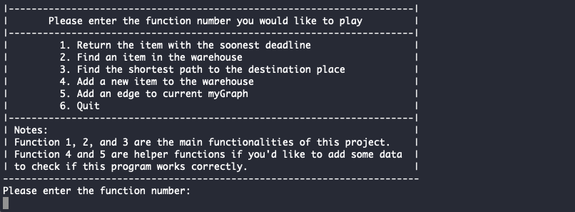

# Algorithm Final Project

## Project Structure

- **GUI.java**: This is a user interface for instructors to test and mark the functionalities.
- **DataGenerator.java**: This is a self-written dummy data generator. It could generate both item information and graph information.
- **Item.java**: This is the class used to represent a real parcel in the delivery company.
- **MinHeap.java**: Implemented marking functionality 1.
- **RedBlackTree.java**: Implemented marking functionality 2.
- **Graph.java, Edge.java, Vertex.java**: Implemented marking functionality 3.
- **DijkstrasShortestPathAdjacencyList.java**: A reference class derived from GitHub, used to check the correctness of the functionality 3.
- Test files are given as well.

## How to use this app?

To compile and run this app, the only thing you need to do is type the following commands in terminal: 
```
javac GUI.java
java GUI
```
*Note*: make sure you are under the right folder, such as `../final-u6865190/program-u6865190`)

The success start screen should look like this: 


In order to test the functionalities, you first need to choose which test file you would like to use. The first two functionalities, min-heap and red-black tree, are initialized using the same data set. Thus, you only need to choose once to create these two data structures. Similarly, you need to select which graph you would like to use. 


Then just feel free to play around :)



I also recorded a short video to walk you through this application briefly, if you are interested, you could find it here:

[](https://youtu.be/v8Bd8SjbjIQ)
